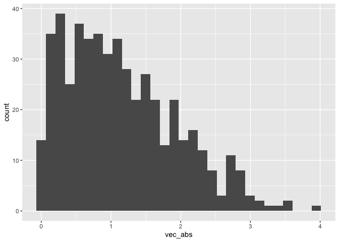

Simple document
================
Maya Krishnamoorthy
2024-09-10

I loaded necessary packages (e.g. `tidyverse`).

I’m an R Markdown document!

# Section 1

Here’s a **code chunk** that samples from a *normal distribution*:

``` r
samp = rnorm(100)
length(samp)
```

    ## [1] 100

# Section 2

I can take the mean of the sample, too! The mean is -0.027068.

# Section 3 - Learning Assessment

Here’s a **code chunk** for the learning assessment (Sep 10). It creates
`la_df` and then plots a histogram. We can use option+cmd+i to create a
new code chunk.

``` r
la_df = tibble(
  vec_num = rnorm(500, mean=1),
  vec_log = vec_num>0,
  vec_abs = abs(vec_num)
)

# If we don't want code to show, make a new code chunk and don't evaluate (i.e. eval=FALSE, echo=FALSE)
ggplot(la_df, aes(x = vec_abs)) + geom_histogram()
```

<!-- -->

## Text formatting

*italic* or *italic* **bold** or **bold** `code` superscript<sup>2</sup>
and subscript<sub>2</sub>

## Headings

# 1st Level Header

## 2nd Level Header

### 3rd Level Header

## Lists

- Bulleted list item 1

- Item 2

  - Item 2a

  - Item 2b

1.  Numbered list item 1

2.  Item 2. The numbers are incremented automatically in the output.

## Tables

| First Header | Second Header |
|--------------|---------------|
| Content Cell | Content Cell  |
| Content Cell | Content Cell  |
